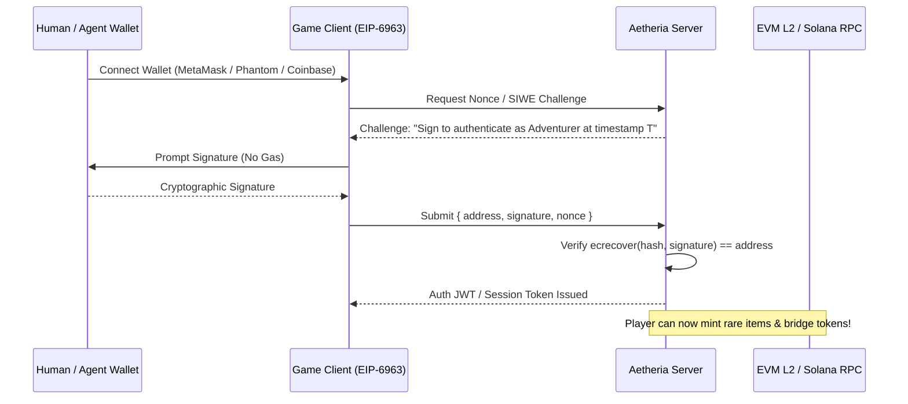

# Aetheria: Classic Realms - Web3 & Real Crypto Integration

## 1. Supported Blockchains & Layer-2 Networks

Aetheria is architected for micro-fee, high-throughput blockchains:
- **Base (Coinbase L2)**: Default EVM Layer-2 for cheap in-game Gold minting and micro-tipping.
- **Polygon (PoS / zkEVM)**: Ultra-fast state settlement and NFT marketplace bridges.
- **Arbitrum One / Nova**: Gaming-optimized low-gas L2.
- **Sepolia Testnet**: Free zero-cost test network for testing all contracts without real capital.
- **Solana**: High-frequency micro-transactions via SPL tokens and Metaplex standards.

---

## 2. Smart Contract Architectures

### 1. In-Game Gold Token (`RealmGold.sol` / ERC-20 & SPL)
- Standard ERC-20 token interface with Permit (EIP-2612) for gasless approvals.
- Exchange rate: 100 in-game Realm Coins = 1 `$REALM` / `$GOLD` token.
- Secure deposit/withdrawal escrow mechanism with server signature verification to prevent exploits.

### 2. Rare Artifact & Equipment NFTs (`RealmArtifacts.sol` / ERC-721 & ERC-1155)
- Standard tokenized weapons, rare boss trophies, holiday cosmetics (Party Hats, Dragon Chainbodies, Rune Godswords).
- Dynamic on-chain metadata with IPFS / Arweave decentralized image hosting.

---

## 3. Wallet Connection & Authentication Flow

---

## 4. Non-Custodial Architecture & Guest Mode
- Players without crypto wallets can play immediately in **Guest / Traditional Mode** with full feature access.
- Any guest account can link a Web3 wallet at any time without losing character progress or inventory.
- Private keys never touch the server. All transactions are signed client-side by the player's wallet.
